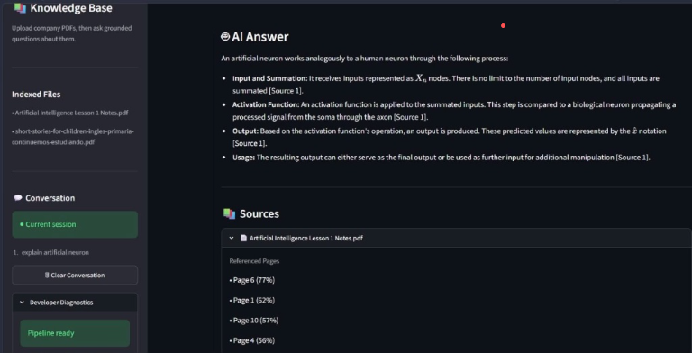
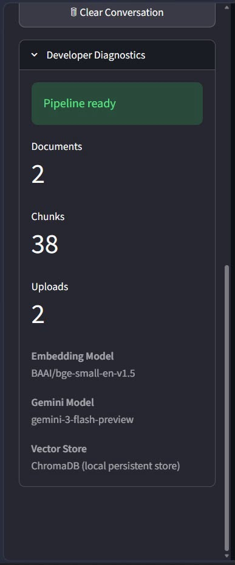
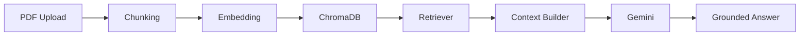

# Enterprise Company Knowledge Assistant

> A Streamlit-based Retrieval-Augmented Generation (RAG) application that turns company PDF documents into a grounded, conversational knowledge workspace.

[](https://www.python.org/)
[](https://streamlit.io/)
[](https://www.trychroma.com/)
[](https://ai.google.dev/)
[](https://huggingface.co/)
[](#license)

## Business Problem

Company knowledge is often distributed across lengthy PDFs, policies, onboarding materials, and internal reference documents. Finding reliable answers is slow, while relying on memory or manual search makes it difficult to verify where information came from. This application provides a focused knowledge interface: users upload company PDFs, ask questions in natural language, and receive answers grounded in retrieved document context with grouped source citations.

## Screenshots

### Home Interface

The main application interface with document management, conversation history, and the AI workspace.


---

### AI Answer with Grounded Citations

Example of a grounded response generated from the uploaded documents, along with grouped source citations.



---

### Developer Diagnostics

Built-in diagnostics showing pipeline status, embedding model, vector store, and document statistics.



---

### Hallucination Prevention

The assistant refuses to fabricate information when the uploaded documents do not contain the requested information, ensuring answers remain grounded in the knowledge base.


## Features

- Multi-document RAG
- Semantic Search
- ChromaDB Vector Database
- HuggingFace Embeddings
- Gemini Integration
- Grounded Responses
- Grouped Source Citations
- Conversation History
- Enterprise UI
- Developer Diagnostics

## Architecture



Uploaded PDFs are parsed and split into text chunks. The chunks are embedded with a local Hugging Face model and stored in a persistent ChromaDB collection. For each question, the application retrieves the most relevant chunks, builds bounded context with source metadata, and sends that context to Gemini to generate an answer grounded in the retrieved documents.

## Why RAG Instead of Fine-Tuning?

RAG is a better fit for document-backed company knowledge because the source material can change frequently. New or revised PDFs can be added to the knowledge base without retraining a model. Retrieval also keeps the answer tied to the relevant document chunks and supports source citations, making responses easier to verify. Fine-tuning is better suited to changing model behavior or style; it is not an efficient mechanism for maintaining a changing set of company documents.

## Tech Stack

| Layer | Technology | Purpose |
| --- | --- | --- |
| Application UI | Streamlit | Conversational document Q&A interface, upload flow, and diagnostics |
| Language | Python | Application and pipeline implementation |
| Document Processing | PyPDF / LangChain | PDF loading and document handling |
| Chunking | RecursiveCharacterTextSplitter | Splits extracted content into overlapping chunks |
| Embeddings | Hugging Face `BAAI/bge-small-en-v1.5` | Creates local semantic embeddings |
| Vector Database | ChromaDB | Persists and searches embedded document chunks |
| Generation | Google Gemini API | Generates answers from retrieved context |
| Configuration | python-dotenv | Loads the Gemini API key and optional model setting |

## Project Structure

```text
company-knowledge-assistant/
├── app.py                     # Streamlit application and UI presentation
├── backend/
│   ├── context.py              # Retrieved-context and citation construction
│   ├── embeddings.py           # Hugging Face embedding configuration
│   ├── ingest.py               # PDF ingestion orchestration
│   ├── loaders.py              # PDF loading and metadata preparation
│   ├── rag.py                  # Grounded Gemini answer generation
│   ├── retrieval.py            # ChromaDB semantic retrieval
│   ├── splitter.py             # Text chunking configuration
│   ├── utils.py                # Paths, environment, and upload helpers
│   └── vectorstore.py          # ChromaDB persistence operations
├── data/
│   ├── uploads/                # Saved PDF uploads
│   └── chroma_db/              # Persistent ChromaDB data
├── assets/                     # Project assets
├── .env.example                # Environment variable template
├── requirements.txt            # Python dependencies
└── README.md
```

## Installation

1. Clone the repository and open the project directory.

   ```bash
   git clone <repository-url>
   cd company-knowledge-assistant
   ```

2. Create and activate a virtual environment.

   ```bash
   python -m venv venv
   ```

   **Windows (PowerShell)**

   ```powershell
   .\venv\Scripts\Activate.ps1
   ```

   **macOS / Linux**

   ```bash
   source venv/bin/activate
   ```

3. Install dependencies.

   ```bash
   pip install -r requirements.txt
   ```

4. Create a `.env` file from the provided template and set a Gemini API key.

   ```bash
   copy .env.example .env
   ```

   On macOS or Linux, use `cp .env.example .env` instead. Then update:

   ```env
   GEMINI_API_KEY=your_gemini_api_key_here
   ```

   `GEMINI_MODEL` is optional; the application uses its configured default when it is not set. Embeddings run locally, so they do not require an API key.

5. Start the application.

   ```bash
   streamlit run app.py
   ```

## Example Workflow

1. Open the **Upload documents** tab and select one or more company PDFs.
2. Select **Process Documents** to extract text, create embeddings, and store document chunks in ChromaDB.
3. Open the **Ask questions** tab and enter a question such as: `What is the company leave policy?`
4. Review the grounded answer and expand the grouped source cards to see the contributing document and referenced pages.
5. Continue asking questions; the current conversation remains available in the session sidebar until **Clear Conversation** is selected.

## Future Improvements

- Authentication and role-based access controls
- Cloud deployment and managed document storage
- Support for additional document formats
- Document lifecycle management, including replacement and deletion workflows
- Evaluation datasets and retrieval-quality reporting
- Multi-user conversation persistence

## License

This project is licensed under the MIT License.
