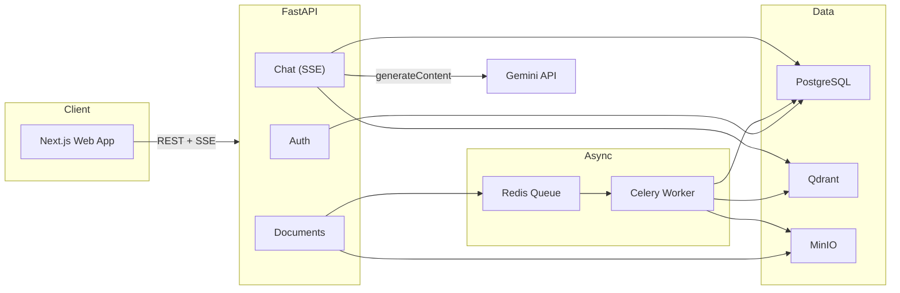

# Enterprise AI Knowledge Platform

> A production-oriented Retrieval-Augmented Generation (RAG) platform that turns company documents into a grounded, multi-user conversational knowledge workspace — FastAPI + Next.js + PostgreSQL + Qdrant + MinIO, orchestrated with Docker Compose.

[](https://www.python.org/)
[](https://fastapi.tiangolo.com/)
[](https://nextjs.org/)
[](https://www.postgresql.org/)
[](https://qdrant.tech/)
[](https://ai.google.dev/)
[](#license)

> This is v2 of the project, rebuilt from a single-file Streamlit prototype into a real multi-service platform per [`ARCHITECTURE_REVIEW.md`](./ARCHITECTURE_REVIEW.md), which remains the source of truth for the overall roadmap.

## Business Problem

Company knowledge is often distributed across lengthy PDFs, policies, onboarding materials, and internal reference documents. Finding reliable answers is slow, while relying on memory or manual search makes it difficult to verify where information came from. This platform provides a grounded knowledge interface: users upload company PDFs, ask questions in natural language, and receive streamed answers backed by retrieved document context with source citations — behind real authentication, on infrastructure that survives a redeploy.

## Features (Phase 1)

- FastAPI REST backend with JWT authentication (Admin / Employee roles)
- Next.js 16 (App Router) chat UI with streamed, token-by-token answers
- Async ingestion: uploads are validated, stored in MinIO, and processed by Celery workers — the API never blocks on chunking/embedding
- Local Hugging Face embeddings (`BAAI/bge-small-en-v1.5`) — zero-cost, offline-capable
- Qdrant vector store, one collection per organization (multi-tenant-ready)
- PostgreSQL for users, organizations, document registry, and query audit log
- Gemini answer generation via the official SDK, streamed over Server-Sent Events
- Fully containerized: `docker-compose up` runs the entire stack

## Architecture



Uploaded PDFs are stored in MinIO and queued for a Celery worker, which loads, chunks, embeds (locally), and indexes them into the organization's Qdrant collection while PostgreSQL tracks ingestion status. Questions are answered by retrieving the most relevant chunks from Qdrant, building bounded context with citations, and streaming a grounded answer from Gemini back to the browser over SSE. Every query is logged to `query_log` for audit and future analytics.

## Why RAG Instead of Fine-Tuning?

RAG is a better fit for document-backed company knowledge because the source material can change frequently. New or revised PDFs can be added to the knowledge base without retraining a model. Retrieval also keeps the answer tied to the relevant document chunks and supports source citations, making responses easier to verify.

## Tech Stack

| Layer | Technology | Purpose |
| --- | --- | --- |
| Frontend | Next.js 16 (App Router) + shadcn/ui + Tailwind | Chat UI, auth, document upload |
| Backend API | FastAPI | Auth, document, and chat endpoints; async by default |
| Database | PostgreSQL 16 | Organizations, users, documents, query log |
| Vector Database | Qdrant | Per-organization semantic search collections |
| Object Storage | MinIO (S3-compatible) | Permanent original-document storage |
| Async Queue | Celery + Redis | Non-blocking document ingestion |
| Embeddings | Hugging Face `BAAI/bge-small-en-v1.5` (local) | Semantic chunk embeddings, no API cost |
| Generation | Google Gemini API (`google-generativeai` SDK) | Streamed, grounded answer generation |
| Auth | JWT (access + refresh) | Stateless, role-aware authentication |

## Project Structure

```text
company-knowledge-assistant/
├── backend/                    # FastAPI service
│   ├── app/
│   │   ├── api/v1/              # auth, documents, chat routers
│   │   ├── core/                 # settings, JWT/password security, logging
│   │   ├── db/                   # SQLAlchemy models, session, seed
│   │   ├── rag/                  # loaders, splitter, embeddings, Qdrant store, Gemini
│   │   ├── storage/               # MinIO/S3 client
│   │   ├── workers/               # Celery app + ingestion task
│   │   ├── schemas/               # Pydantic request/response models
│   │   ├── deps.py                # JWT auth dependencies
│   │   └── main.py                # FastAPI app entrypoint
│   ├── alembic/                  # database migrations
│   ├── requirements.txt
│   └── Dockerfile
├── frontend/                   # Next.js app
│   ├── app/                      # login, register, chat, knowledge routes
│   ├── components/               # shadcn/ui + feature components
│   ├── lib/                       # API client, auth context
│   └── Dockerfile
├── docker-compose.yml           # postgres, qdrant, minio, redis, api, worker, web
├── ARCHITECTURE_REVIEW.md       # v2 architecture source of truth
└── README.md
```

## Running Locally

Requires [Docker Desktop](https://www.docker.com/products/docker-desktop/).

1. Clone the repository and open the project directory.
2. Configure the backend environment:

   ```bash
   cp backend/.env.example backend/.env
   ```

   Set `GEMINI_API_KEY` and generate a strong `JWT_SECRET_KEY` in `backend/.env`. The Postgres/Qdrant/MinIO/Redis connection settings already match the services docker-compose starts, so they don't need to change for local use.

3. Start the full stack:

   ```bash
   docker-compose up --build
   ```

   This runs database migrations automatically, then starts the API (`:8000`), the Celery worker, and the web app (`:3000`).

4. Open [http://localhost:3000](http://localhost:3000), register the first account (it is automatically granted the Admin role), upload a PDF from **Knowledge base**, and ask a question from **Ask questions**.

API docs (Swagger UI) are available at [http://localhost:8000/docs](http://localhost:8000/docs).

## Roadmap

Phase 1 (this release) covers the foundation: FastAPI/Next.js/Postgres/Qdrant/MinIO/Celery, JWT auth, and streamed answers. See [`ARCHITECTURE_REVIEW.md`](./ARCHITECTURE_REVIEW.md) for the full three-phase roadmap — hybrid search, reranking, conversation memory, multi-tenancy, RBAC, OCR, and enterprise integrations.

## License

This project is licensed under the MIT License.
