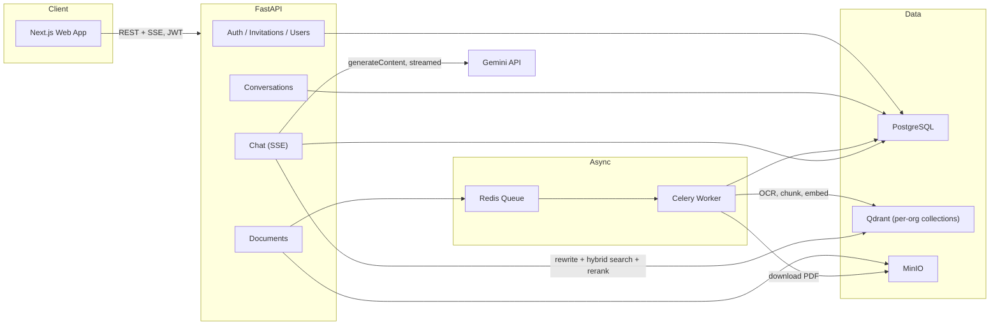

# Enterprise AI Knowledge Platform

> A multi-tenant, RBAC-secured Retrieval-Augmented Generation (RAG) platform that turns company PDFs into a grounded, conversational knowledge base — FastAPI + Next.js + PostgreSQL + Qdrant + MinIO + Celery, orchestrated with Docker Compose.

[](https://www.python.org/)
[](https://fastapi.tiangolo.com/)
[](https://nextjs.org/)
[](https://www.postgresql.org/)
[](https://qdrant.tech/)
[](https://ai.google.dev/)
[](#license)

> Rebuilt from a single-file Streamlit prototype into a real multi-service platform. [`ARCHITECTURE_REVIEW.md`](./ARCHITECTURE_REVIEW.md) is the living source of truth for the phased roadmap this project follows.

## Project Status

This is a working MVP / portfolio project — the full pipeline (auth, multi-tenancy, RBAC, async ingestion with OCR, hybrid retrieval, conversational RAG) runs end-to-end locally via `docker-compose up`. A production Docker Compose deployment with TLS is included in [`docker-compose.production.yml`](./docker-compose.production.yml); see [Production deployment](#production-deployment).

**Live demo:** intentionally not hosted publicly right now. This system runs seven backing services (PostgreSQL, Qdrant, MinIO, Redis, the API, a Celery worker, and the web app) plus two locally-run ML models (embedding + cross-encoder reranking) — a footprint suited to a persistent VM or equivalent, not the always-free serverless tiers that fit a lightweight demo. Rather than simplify the architecture just to force it onto a free host, the production deployment path below is fully built and documented, and stands as evidence of how this system is meant to run; standing it up publicly is deferred until it's worth the always-on infrastructure cost. Clone-and-run locally (below) reproduces the full system, including production parity via `docker-compose.production.yml`.

## Overview

Company knowledge is usually scattered across long PDFs — policies, onboarding guides, internal reference docs — that are slow to search and hard to verify once found. This platform gives every organization its own isolated, grounded Q&A workspace: upload PDFs (including scanned ones), ask questions in plain language across multi-turn conversations, and get streamed answers backed by cited source passages, all behind real authentication and a five-tier permission model.

It's built as a realistic enterprise system rather than a demo: async ingestion so uploads never block the API, hybrid search with reranking rather than naive vector similarity, per-organization data isolation enforced at both the database and vector-store level, and a real conversation/thread model instead of a single flat chat log.

## Problem It Solves

- **Findability** — natural-language search over internal PDFs instead of manual skimming.
- **Trust** — every answer is grounded in retrieved chunks and cites its source document + page, so claims are verifiable rather than taken on faith.
- **Isolation** — each organization's documents, conversations, and vector index are fully separated; no tenant can query another tenant's content, even by guessing an ID.
- **Access control** — not every document action should be available to everyone; a five-tier role hierarchy (Super Admin → Company Admin → Manager → Employee → Guest) governs who can upload, delete, invite, and manage members.
- **Scanned documents** — PDFs that are image-only (no embedded text layer) are still searchable, via automatic OCR fallback per page.

## Key Features

- **Conversational RAG chat** — token-by-token streamed answers (SSE) grounded in retrieved chunks, with inline source citations and a PDF viewer that jumps to the cited page.
- **Real conversation/thread system** — each chat lives in its own `Conversation`; the sidebar groups threads into Today/Yesterday/Older, conversation memory is scoped per-thread (a new conversation never inherits prior context), and deleting a conversation never touches the underlying documents.
- **Conversational query rewriting** — follow-up questions ("what about last year?") are rewritten into standalone retrieval queries using only that conversation's own history before search runs; falls back to the original question on any failure so a bad rewrite can degrade retrieval but never introduce facts into the answer.
- **Hybrid retrieval + reranking** — dense vector search (Qdrant) and BM25 keyword search run as independent branches, merged with Reciprocal Rank Fusion, then reordered by a cross-encoder (`ms-marco-MiniLM-L-6-v2`) before the top-k reaches the LLM.
- **Async, resilient ingestion** — uploads are validated and stored in MinIO, then queued to a Celery worker for chunking/embedding/indexing; the API returns immediately (202) and never blocks on processing.
- **OCR for scanned PDFs** — any page whose extracted text layer is too thin to be real content is rasterized and OCR'd (Tesseract) automatically; page numbers and citation metadata are preserved, and non-fatal OCR issues surface on the document without failing the whole upload.
- **Multi-tenancy** — every table is keyed to an organization, and each org gets its own Qdrant collection — tenant isolation is structural, not just a `WHERE` filter.
- **Five-tier RBAC** — Super Admin, Company Admin, Manager, Employee, Guest, with per-action minimum-role enforcement (upload vs. delete vs. user management are gated separately) and role-assignment rules that prevent privilege escalation.
- **Invitation-based onboarding** — Company Admins generate single-use, hashed, expiring invite tokens scoped to a specific org + role; registration is otherwise "create your own workspace."
- **Workspace bootstrap** — an existing account stuck in the wrong org can safely found its own new organization and become its Company Admin, without ever self-promoting within an org that has other members.
- **Guest access with expiry** — guest accounts can be time-boxed; the access-token TTL itself is clamped to the expiry so access can't outlive it mid-token.
- **Document lifecycle management** — upload, replace, re-index, delete, and view/download via short-lived presigned URLs.

## Architecture



Uploaded PDFs are stored in MinIO and queued for a Celery worker, which loads the document, OCRs any scanned pages, chunks it, embeds the chunks locally, and indexes them into the organization's own Qdrant collection while PostgreSQL tracks ingestion status. A question is first rewritten into a standalone retrieval query using the current conversation's history, then answered by hybrid search + reranking against Qdrant, bounded-context construction with citations, and a streamed, grounded Gemini response. Every turn is persisted to `query_log` under its owning conversation.

## Why RAG Instead of Fine-Tuning?

Source documents change frequently — policies get revised, new material gets added — and RAG lets the knowledge base update by re-indexing, not retraining. It also keeps every answer traceable to specific retrieved chunks, which is what makes citations and "the document didn't say that" grounding possible.

## Tech Stack

| Layer | Technology | Purpose |
| --- | --- | --- |
| Frontend | Next.js 16 (App Router) + React 19 + Tailwind v4 + Base UI | Chat UI, auth, document/admin management |
| Backend API | FastAPI | Auth, documents, conversations, chat, admin endpoints |
| Database | PostgreSQL 16 (SQLAlchemy 2.0 + Alembic) | Orgs, users, documents, conversations, query log, invitations |
| Vector Database | Qdrant | One collection per organization for dense semantic search |
| Keyword Search | `rank-bm25` (in-process BM25) | Sparse branch of hybrid retrieval, fused with dense via RRF |
| Reranking | `sentence-transformers` cross-encoder | Final relevance ordering before context construction |
| Object Storage | MinIO (S3-compatible) | Original PDF storage, served via presigned URLs |
| Async Queue | Celery + Redis | Non-blocking document ingestion |
| Embeddings | Hugging Face `BAAI/bge-small-en-v1.5` (local) | Chunk embeddings, no external API cost |
| OCR | PyMuPDF (rasterization) + Tesseract | Text recovery for scanned/image-only PDF pages |
| Generation | Google Gemini (`google-genai` SDK) | Streamed grounded answers + query rewriting |
| Auth | JWT (access + refresh), `passlib`/bcrypt | Stateless, role- and org-aware authentication |

## How the RAG Pipeline Works

**Ingestion** (`documents.py` → `workers/tasks.py`)
1. A PDF is validated (type, size) and uploaded to MinIO; a `Document` row is created with status `pending`, and a Celery task is enqueued. The API responds `202` immediately.
2. The worker downloads the file and loads it page-by-page (`PyPDFLoader`). Any page whose extracted text is shorter than a minimal threshold is treated as scanned: it's rasterized at 300 DPI (PyMuPDF) and passed through Tesseract OCR, with the recognized text cleaned/normalized (dehyphenation, whitespace) and substituted back in — page numbers and citation metadata are untouched either way.
3. Pages are chunked (`splitter.py`) with heading-aware merging and a separator hierarchy that prefers paragraph/sentence boundaries over raw character counts (1000-char chunks, 200-char overlap).
4. Chunks are embedded locally (`BAAI/bge-small-en-v1.5`) and written to the organization's Qdrant collection, stamped with `org_id`/`doc_id` for defense-in-depth filtering.
5. The `Document` row is updated to `ready` (with chunk/page counts) or `failed` (with an error message). OCR pages that couldn't be read are recorded as a non-fatal warning on an otherwise-`ready` document rather than failing the whole upload.

**Retrieval & Answering** (`chat.py` → `rag/rag.py`)
1. A question arrives with a `conversation_id`. The server loads that conversation's own recent turns from `query_log` (never trusted from the client) and verifies ownership before doing anything else.
2. The question is rewritten into a standalone retrieval query using only that history (`query_rewrite.py`) — e.g. "what about last year?" → "what was the leave policy last year?" — falling back to the original question if there's no history to resolve against, the rewrite model is unreachable, or the output looks unusable. This only changes what string is searched with; the original question still goes to the LLM.
3. Hybrid retrieval (`retrieval.py`) runs dense (Qdrant cosine similarity) and sparse (BM25 over the org's full chunk corpus) search in parallel, each returning ~20 candidates, merged via Reciprocal Rank Fusion so the two differently-scaled rankings combine on rank position rather than raw score.
4. The fused candidate set is reranked by a cross-encoder for the final top-k (default 4).
5. Bounded context is built (`context.py`, default 12,000 characters) with labeled source blocks (`[Source N: filename, page X]`) and a matching `SourceCitation` per block.
6. Gemini streams the answer over SSE, grounded by a system prompt that requires citing sources inline and refusing to answer beyond the supplied context. The full answer, latency, and sources are persisted to `query_log` under the conversation, which is titled from the first question (no extra LLM call — a deterministic, word-boundary-truncated title) if it doesn't have one yet.

## Multi-Tenancy and RBAC

**Multi-tenancy** is structural, not a query filter bolted on top: every table (`users`, `documents`, `conversations`, `query_log`, `invitations`) carries an `org_id`, and each organization gets its own Qdrant collection (`{prefix}_{org_id}`) rather than sharing one collection with a metadata filter. Every authenticated request carries `org_id` and `role` inside its JWT; handlers read identity from there — **never** from request parameters — so a user cannot reach another organization's data by editing an id in the URL or body.

**Role hierarchy** (highest to lowest rank):

| Role | Typical capability |
| --- | --- |
| Super Admin | Highest rank; no bootstrapped path grants this role via the API by design |
| Company Admin | Delete documents, manage org members, generate invitations, bootstrap a new workspace |
| Manager | Upload / replace / re-index documents |
| Employee | Chat and search over the org's indexed documents |
| Guest | Chat and search only, optionally time-boxed via `expires_at` |

Permission checks are pure, DB-free functions (`app/core/rbac.py`: `has_at_least`, `can_assign_role`, `guest_access_ttl`, `can_bootstrap_own_workspace`) wired into FastAPI via a `require_role(minimum)` dependency factory — the same logic is unit-tested in isolation and enforced at every route. A Company Admin can grant roles up to their own rank but never above it, and cannot edit a Super Admin's account; guest accounts get an access-token TTL clamped to their expiry so access can't outlive it mid-token.

Onboarding has two paths: **create a workspace** (the registrant becomes that org's Company Admin) or **join via invitation** — a single-use, SHA-256-hashed, expiring token generated by a Company Admin, optionally locked to a specific email. An existing account that's stuck in the wrong org can also call `POST /auth/create-workspace` to found a brand-new org and move itself there as Company Admin — this is blocked if doing so would strand a real multi-member org without an admin.

## Project Structure

```text
company-knowledge-assistant/
├── backend/
│   ├── app/
│   │   ├── api/v1/            # auth, documents, chat, conversations, users, invitations
│   │   ├── core/               # settings, JWT/password security, RBAC, logging
│   │   ├── db/                 # SQLAlchemy models, session
│   │   ├── rag/                 # loaders, OCR, splitter, embeddings, retrieval, reranker,
│   │   │                        # context, query rewriting, Gemini generation, vectorstore
│   │   ├── storage/              # MinIO/S3 client
│   │   ├── workers/              # Celery app + ingestion task
│   │   ├── schemas/               # Pydantic request/response models
│   │   ├── deps.py                # JWT auth + RBAC dependencies
│   │   └── main.py                # FastAPI app entrypoint
│   ├── alembic/                  # hand-written database migrations
│   ├── tests/                    # pure-unit pytest suite (no live DB required)
│   ├── requirements.txt
│   └── Dockerfile
├── frontend/
│   ├── app/                      # login, register, chat, knowledge, admin, settings routes
│   ├── components/                # shadcn/Base UI primitives + feature components
│   ├── lib/                        # typed API client, auth context, role helpers
│   └── Dockerfile
├── docker-compose.yml             # postgres, qdrant, minio, redis, api, worker, web
├── ARCHITECTURE_REVIEW.md         # phased architecture roadmap (source of truth)
└── README.md
```

## Local Setup

Requires [Docker Desktop](https://www.docker.com/products/docker-desktop/).

1. Clone the repository and open the project directory.
2. Configure the backend environment:

   ```bash
   cp backend/.env.example backend/.env
   ```

   Set `GEMINI_API_KEY` (from [Google AI Studio](https://ai.google.dev/)) and a strong random `JWT_SECRET_KEY` in `backend/.env`. The Postgres/Qdrant/MinIO/Redis connection settings already match the services `docker-compose` starts, so they don't need to change for local use.

3. Start the full stack:

   ```bash
   docker-compose up --build
   ```

   This runs database migrations automatically (`alembic upgrade head`), then starts the API (`:8000`), the Celery worker, and the web app (`:3000`).

4. Open [http://localhost:3000](http://localhost:3000), register the first account (**Create workspace** — it becomes that org's Company Admin), upload a PDF from **Knowledge base**, and start a conversation from **Ask questions**.

API docs (Swagger UI) are available at [http://localhost:8000/docs](http://localhost:8000/docs).

### Running backend-only (no Docker)

```bash
pip install -r backend/requirements.txt
# point DATABASE_URL / QDRANT_URL / S3_ENDPOINT_URL / REDIS_URL at real instances
cd backend && uvicorn app.main:app --reload         # terminal 1
celery -A app.workers.celery_app worker -Q ingestion  # terminal 2
```

```bash
cd frontend && npm install && npm run dev
```

### Tests & linting

```bash
cd backend && pytest        # pure-unit suite (RBAC, security, retrieval, reranking,
                             # context building, OCR, loaders, query rewriting,
                             # conversation ownership/title generation) — no DB required
cd frontend && npm run lint && npm run build
```

## Environment Variables

Set in `backend/.env` (see `backend/.env.example` for the full template — **never commit this file**; it's git-ignored).

| Variable | Purpose |
| --- | --- |
| `JWT_SECRET_KEY` | Signing key for access/refresh JWTs — must be a long random secret |
| `JWT_ALGORITHM` | JWT signing algorithm (default `HS256`) |
| `ACCESS_TOKEN_EXPIRE_MINUTES` / `REFRESH_TOKEN_EXPIRE_DAYS` | Token lifetimes |
| `DATABASE_URL` | PostgreSQL connection string |
| `QDRANT_URL` / `QDRANT_API_KEY` | Qdrant endpoint and optional API key |
| `QDRANT_COLLECTION_PREFIX` | Prefix used to derive each org's collection name |
| `S3_ENDPOINT_URL` | MinIO/S3 endpoint reachable from the API/worker containers |
| `S3_PUBLIC_ENDPOINT_URL` | MinIO/S3 endpoint reachable from the browser (presigned URLs) |
| `S3_ACCESS_KEY` / `S3_SECRET_KEY` | Object storage credentials |
| `S3_BUCKET_NAME`, `S3_REGION`, `S3_USE_SSL` | Object storage configuration |
| `REDIS_URL`, `CELERY_BROKER_URL`, `CELERY_RESULT_BACKEND` | Async task queue configuration |
| `EMBEDDING_MODEL` | Hugging Face embedding model id (local, no API key needed) |
| `GEMINI_API_KEY` | Google Gemini API key — required for answer generation and query rewriting |
| `GEMINI_MODEL`, `GEMINI_TEMPERATURE`, `GEMINI_MAX_OUTPUT_TOKENS` | Generation configuration |
| `RETRIEVAL_TOP_K` | Number of chunks returned to the LLM after reranking |
| `MAX_CONTEXT_CHARACTERS` | Character budget for assembled RAG context |
| `RERANKER_MODEL` | Cross-encoder model id used for reranking |
| `CONVERSATION_MEMORY_TURNS` | How many prior turns of a conversation feed into rewriting/generation |
| `OCR_ENABLED` | Toggle OCR fallback for scanned pages |
| `OCR_PROVIDER` | Selects an OCR engine from the provider registry (currently `tesseract`) |
| `MAX_UPLOAD_SIZE_MB` | Upload size limit enforced at the API layer |

Frontend config (`frontend/.env.local`, see `.env.local.example`): `NEXT_PUBLIC_API_URL` — the backend base URL the browser talks to.

## Docker / Deployment Overview

`docker-compose.yml` runs seven services: `postgres`, `qdrant`, `minio`, `redis`, `api`, `worker`, and `web`. The `api` container runs Alembic migrations on startup, then Uvicorn with `--reload` for local iteration; `worker` runs a Celery worker consuming the `ingestion` queue; both mount `./backend` as a live volume. `web` is built with `NEXT_PUBLIC_API_URL` baked in at build time.

This compose setup is oriented at local development, not a hardened production deployment — there's no reverse proxy/TLS termination, no secrets manager (`.env` is loaded directly), and `--reload` plus bind-mounted source aren't appropriate for production containers. See **Future Improvements** below.

## Production Deployment

This is the documented, tested path for standing the full stack up on a real host — kept current and validated (`docker compose config` against both `docker-compose.yml` and `docker-compose.production.yml` passes) even though a public instance isn't running right now (see [Project Status](#project-status)).

This repository is **not a Streamlit application**. It is a Next.js client plus FastAPI API, Celery worker, PostgreSQL, Qdrant, Redis, and S3-compatible storage. Streamlit Community Cloud cannot host this architecture or its persistent services. The supported production route is a Linux VM (or a container platform that supports the full Compose stack) with DNS for two hostnames:

- `APP_DOMAIN` for the web application and API (for example, `assistant.example.com`)
- `S3_PUBLIC_DOMAIN` for time-limited document view/download URLs (for example, `storage.example.com`)

The production Compose file runs Caddy as the only public-facing service. It automatically obtains and renews TLS certificates once both DNS records point to the production host. Postgres, Qdrant, Redis, MinIO, the API, and the worker remain private to the Docker network. Uploaded company PDFs are persisted in the named `minio_data` volume; they are not read from a developer's computer after upload.

1. Provision a Linux host with Docker Engine and Docker Compose v2. Point the two DNS names above at it and allow inbound TCP 80/443.
2. Copy [`deploy/.env.production.example`](./deploy/.env.production.example) to `deploy/.env.production` on that host and lock it down with `chmod 600 deploy/.env.production`. Replace every `replace-with-...` value with a unique secret. Generate the database password with `openssl rand -hex 32`, then use the exact same value in `POSTGRES_PASSWORD` and `DATABASE_URL`. Generate the two MinIO values with `openssl rand -hex 32`; `S3_ACCESS_KEY`/`S3_SECRET_KEY` must equal the corresponding MinIO root credentials.
3. Create a **new** Gemini API key and assign it only to `GEMINI_API_KEY` in `deploy/.env.production`. Never place it in source control, browser-visible `NEXT_PUBLIC_*` variables, or a frontend environment file.
4. From the repository root, run the non-destructive preflight check. It validates the secret-file permissions, placeholders, DNS resolution, and Compose syntax without printing secrets:

   ```bash
   chmod +x deploy/preflight.sh
   ./deploy/preflight.sh
   ```

5. Start the production stack:

   ```bash
   docker compose --env-file deploy/.env.production -f docker-compose.production.yml up -d --build
   ```

6. Verify startup with `docker compose --env-file deploy/.env.production -f docker-compose.production.yml ps` and open `https://APP_DOMAIN/ready`; it must return `{"status":"ready"}`. Then register an organization, upload a representative PDF, wait for its status to become **Ready**, and ask a question whose answer is stated in that PDF. Confirm the response contains the expected source citation.

The frontend requires `NEXT_PUBLIC_API_URL` at build time and intentionally has no `localhost` fallback. `CORS_ORIGINS` must be a JSON array containing the exact HTTPS application origin, e.g. `["https://assistant.example.com"]`.

## Example Usage

```bash
# Register (creates a new organization; you become its Company Admin)
curl -X POST http://localhost:8000/api/v1/auth/register \
  -H "Content-Type: application/json" \
  -d '{"email":"you@company.com","password":"a-strong-password","full_name":"Your Name","organization_name":"Acme Inc"}'

# Upload a PDF (Manager role or above)
curl -X POST http://localhost:8000/api/v1/documents \
  -H "Authorization: Bearer $ACCESS_TOKEN" \
  -F "file=@handbook.pdf"

# Start a conversation, then ask a question (non-streaming variant)
CONV_ID=$(curl -s -X POST http://localhost:8000/api/v1/conversations \
  -H "Authorization: Bearer $ACCESS_TOKEN" | jq -r .id)

curl -X POST http://localhost:8000/api/v1/chat/ask-sync \
  -H "Authorization: Bearer $ACCESS_TOKEN" -H "Content-Type: application/json" \
  -d "{\"question\":\"How many vacation days do employees get?\",\"conversation_id\":\"$CONV_ID\"}"
```

The primary chat path (`POST /chat/ask`) streams the answer token-by-token over Server-Sent Events instead of returning it all at once — used by the web UI.

## Future Improvements

Tracked in [`ARCHITECTURE_REVIEW.md`](./ARCHITECTURE_REVIEW.md) as the longer-term roadmap:

- **Production-hardened deployment** — reverse proxy/TLS, a secrets manager instead of `.env` files, non-`--reload` containers, CI/CD.
- **Collections** — named, topic-scoped document groupings (referenced in the architecture doc's permission matrix but not yet implemented).
- **Document version history** — replace/re-index currently overwrite in place rather than tracking superseded versions.
- **Cloud OCR backend** — the OCR provider registry already has a clean swap point (`app/rag/ocr.py`) for adding Textract/Google Vision alongside local Tesseract.
- **Analytics dashboard & audit-log viewer** — `query_log` already captures every turn with latency; there's no aggregated UI over it yet.
- **Hallucination / groundedness detection** and **user feedback capture** on answers.
- **Cross-org visibility for Super Admin** — the role exists and out-ranks Company Admin, but no route currently grants cross-org read access; that would need a deliberate, audited bypass path.
- **External integrations** — Slack, Microsoft Teams, SharePoint, Google Drive ingestion sources.

## License

This project is licensed under the MIT License.
